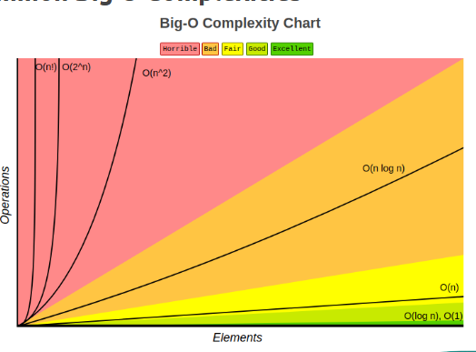

# Time and Space Complexity

Understanding Time and Space Complexity is one of the most important parts of DSA.

It helps us:
- Analyze how efficient an algorithm is
- Compare multiple solutions
- Choose better approaches
- Write optimized code for large inputs

---

## Time Complexity

Time Complexity represents:

> The amount of time an algorithm takes to complete its execution as the input size increases.

Time Complexity is generally represented using:

- Big O Notation `O()`
- Big Theta `Θ()`
- Big Omega `Ω()`

Most commonly used:
- `O(1)`
- `O(log n)`
- `O(n)`
- `O(n log n)`
- `O(n²)`

---

### Big O Notation

Big O Notation is used to measure:

> How well an algorithm scales as the amount of input data increases.

---

### Example 1

Input size:
- 10 elements
- 1 million elements

A good algorithm should still perform efficiently even when the input becomes very large.

---

### Example 2

Consider the equation:

```txt
2*n^3 + 5*n^2 + 19
```

#### When n = 2

```txt
2*8 + 5*4 + 19 = 55
```

#### When n = 3

```txt
2*27 + 5*9 + 19 = 118
```

#### When n = 10

```txt
2*1000 + 5*100 + 19 = 2519
```

As `n` increases:
- Constants become insignificant
- Lower order terms become negligible
- Highest power dominates the growth

Therefore:

```txt
O(n^3)
```

---

### Visualization of Common Big O Complexities



---

### Common Big O Complexities

| Complexity | Name | Performance |
|------------|------|-------------|
| O(1) | Constant | Excellent |
| O(log n) | Logarithmic | Very Good |
| O(n) | Linear | Good |
| O(n log n) | Linearithmic | Fair |
| O(n²) | Quadratic | Bad |
| O(2ⁿ) | Exponential | Horrible |

---

### Activity 1 - Find an Element in an Array

```js
function search(arr, n, target) {
    for (let i = 0; i < n; i++) {
        if (arr[i] === target) {
            return i;
        }
    }
    return -1;
}
```

---

#### Time Complexity

```txt
O(n)
```

#### Why?

- We iterate through the array once
- In the worst case, every element is checked

This is called **Linear Search**.

---

#### Space Complexity

```txt
O(1)
```

#### Why?

No extra data structure is used.

Only a few variables are used regardless of input size.

---

#### Other Examples of O(n)

- Finding max/min element
- Printing all elements in an array
- Searching in an unsorted array
- Traversing a linked list

---

### Activity 2 - Find Common Elements Between Two Arrays

```js
function findCommonElements(arr1, arr2) {
    let commonElements = [];

    for (let i = 0; i < arr1.length; i++) {
        for (let j = 0; j < arr2.length; j++) {
            if (arr1[i] === arr2[j]) {
                commonElements.push(arr1[i]);
                break;
            }
        }
    }

    return commonElements;
}
```

---

#### Time Complexity

```txt
O(n * m)
```

#### Why?

- Two nested loops are used
- Each loop iterates through different arrays

---

#### Space Complexity

```txt
O(min(n, m))
```

#### Why?

The result array stores common elements.

In the worst case, the smaller array size determines the maximum storage needed.

---

### Activity 3 - Two Independent Loops

```js
for (let i = 0; i < N; i++) {
    // statements
}

for (let j = 0; j < M; j++) {
    // statements
}
```

---

#### Time Complexity

```txt
O(n + m)
```

#### Why?

The loops are separate and not nested.

---

#### Space Complexity

```txt
O(1)
```

Only constant variables are used.

---

### Activity 4 - Nested Loop Pattern

```js
for (let i = 0; i < n; i++) {
    for (let j = 0; j <= i; j++) {
        sum += i + j;
    }
}
```

---

#### Time Complexity

```txt
O(n²)
```

#### Why?

Nested loops increase the number of operations quadratically.

---

#### Space Complexity

```txt
O(1)
```

No additional data structures are used.

---

### Activity 5 - Triple Nested Loop

```js
for (let i = 0; i < a; i++) {
    for (let j = 0; j <= b; j++) {
        for (let k = 0; k <= c; k++) {
            console.log(i, j, k);
        }
    }
}
```

---

#### Time Complexity

```txt
O(a * b * c)
```

#### Why?

Three nested loops run independently based on different variables.

---

#### Space Complexity

```txt
O(1)
```

Only constant variables are used.

---

## Important Note

Always express complexity in terms of the variables given in the problem.

Example:

```txt
O(n + m)
```

is more accurate than:

```txt
O(n)
```

when two different input sizes exist.

---

## Space Complexity

Space Complexity represents:

> The amount of memory required by an algorithm as the input size increases.

This includes:
- Input memory
- Variables
- Extra data structures
- Function call stack

---

### Activity 1 - Linear Search

```js
function search(arr, n, target) {
    for (let i = 0; i < n; i++) {
        if (arr[i] === target) {
            return i;
        }
    }
    return -1;
}
```

---

#### Time Complexity

```txt
O(n)
```

#### Space Complexity

```txt
O(1)
```

No additional memory proportional to input size is used.

---

### Activity 2 - Common Elements Problem

```js
function findCommonElements(arr1, arr2) {
    let commonElements = [];

    for (let i = 0; i < arr1.length; i++) {
        for (let j = 0; j < arr2.length; j++) {
            if (arr1[i] === arr2[j]) {
                commonElements.push(arr1[i]);
                break;
            }
        }
    }

    return commonElements;
}
```

---

#### Time Complexity

```txt
O(n * m)
```

#### Space Complexity

```txt
O(min(n, m))
```

---

### Activity 3 - Binary Array Conversion

```js
function getBinaryArray(arr, n) {
    const binaryArray = new Array(n);

    for (let i = 0; i < n; i++) {
        if(arr[i] % 2 == 0){
            binaryArray[i] = 0;
        } else {
            binaryArray[i] = 1;
        }
    }

    return binaryArray;
}
```

---

#### Time Complexity

```txt
O(n)
```

#### Space Complexity

```txt
O(n)
```

#### Why?

A new array of size `n` is created.

---

### Activity 4 - Reverse String

```js
function reverseString(str, m) {
    let revStr = "";

    for(let i = m - 1; i >= 0; i--){
        revStr += str[i];
    }

    return revStr;
}
```

---

#### Time Complexity

```txt
O(m)
```

#### Space Complexity

```txt
O(m)
```

#### Why?

A new reversed string is created.

---

### Activity 5 - Triple Nested Loop

```js
for (let i = 0; i < a; i++) {
    for (let j = 0; j <= b; j++) {
        for (let k = 0; k <= c; k++) {
            console.log(i, j, k);
        }
    }
}
```

---

#### Time Complexity

```txt
O(a * b * c)
```

#### Space Complexity

```txt
O(1)
```

Only constant memory is used.

---

## Trade-Off Between Time and Space

Algorithms require:
- Time to execute
- Memory to store data

In many cases, we trade:
- More memory for less time
OR
- Less memory for more time

---

### Example 1

Finding common elements between two arrays:

#### Approach 1
- Nested loops
- Time: `O(n * m)`
- Space: `O(1)`

#### Approach 2
- Use Map/Hashing
- Time: `O(n + m)`
- Space: `O(n)`

Here we trade extra memory for faster execution.

---

### Example 2

Counting frequency of elements in an array:

#### Approach 1
- Nested loops
- Time: `O(n²)`
- Space: `O(1)`

#### Approach 2
- Use Map/Object
- Time: `O(n)`
- Space: `O(n)`

Again, space is traded for better performance.

---

## Interview Notes

- Always focus on the worst-case complexity.
- Nested loops do not always mean `O(n²)`.
- Separate loops usually add complexities.
- Ignore constants and lower-order terms in Big O.
- Try to optimize both time and space whenever possible.

---

## Common Beginner Mistakes

- Confusing nested loops with all being `O(n²)`
- Forgetting space complexity
- Ignoring input constraints
- Including constants in final Big O answer
- Writing incorrect complexity for multiple variables

---

## Summary

In this section, we covered:

- Time Complexity
- Big O Notation
- Space Complexity
- Common Complexity Types
- Nested Loop Analysis
- Trade-Off Between Time and Space
- Complexity Analysis Examples

Understanding complexity analysis is essential for writing optimized and scalable algorithms.
````
