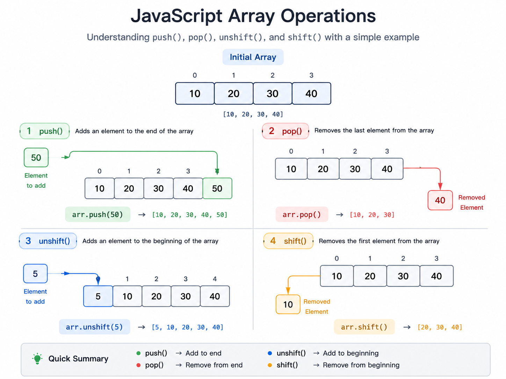

# Arrays

## Collections

A Collection refers to a grouping of multiple items or elements together.

Collections help in:
- Storing data
- Retrieving data
- Manipulating data efficiently

---

## Examples of Collections

- Arrays
- Objects
- Map
- Set

Both JavaScript and Python provide built-in collections.

---

# Arrays

An Array is a collection used to store multiple values in a single variable.

Arrays are one of the most important and commonly used data structures in DSA.

---

## Why Arrays?

Imagine storing marks of 100 students.

Using 100 separate variables would be:
- Difficult to manage
- Hard to access
- Inefficient

Arrays solve this problem by storing multiple values together.

---

## Characteristics of Arrays

- Stores multiple elements
- Elements are accessed using indexes
- Indexing starts from `0`
- Supports traversal using loops
- Allows insertion, deletion, searching, sorting, etc.

---

# Array Declaration

### JavaScript

```js
let nums = [10, 20, 30, 40];
```

### Python

```py
nums = [10, 20, 30, 40]
```

---

# Indexing

Index represents the position of an element in the array.

---

## Example

| Index | Value |
|------|------|
| 0 | 10 |
| 1 | 20 |
| 2 | 30 |
| 3 | 40 |

---

## Accessing Elements

### JavaScript

```js
let nums = [10, 20, 30];

console.log(nums[0]);
```

### Python

```py
nums = [10, 20, 30]

print(nums[0])
```

---

# Traversing an Array

Traversal means visiting all elements of an array one by one.

---

## JavaScript

```js
let nums = [10, 20, 30, 40];

for(let i = 0; i < nums.length; i++) {
    console.log(nums[i]);
}
```

---

## Python

```py
nums = [10, 20, 30, 40]

for i in range(len(nums)):
    print(nums[i])
```

---

# Array Methods Recap

The following are some commonly used array operations.

- `push()`
- `pop()`
- `shift()`
- `unshift()`

---

# Array Operations Visualization



---

# push()

Adds an element to the end of the array.

### JavaScript

```js
let nums = [10, 20];

nums.push(30);

console.log(nums);
```

### Python

```py
nums = [10, 20]

nums.append(30)

print(nums)
```

---

# pop()

Removes the last element from the array.

### JavaScript

```js
let nums = [10, 20, 30];

nums.pop();

console.log(nums);
```

### Python

```py
nums = [10, 20, 30]

nums.pop()

print(nums)
```

---

# shift()

Removes the first element from the array.

### JavaScript

```js
let nums = [10, 20, 30];

nums.shift();

console.log(nums);
```

### Python

```py
nums = [10, 20, 30]

nums.pop(0)

print(nums)
```

---

# unshift()

Adds an element to the beginning of the array.

### JavaScript

```js
let nums = [20, 30];

nums.unshift(10);

console.log(nums);
```

### Python

```py
nums = [20, 30]

nums.insert(0, 10)

print(nums)
```

---

# Basic Array Operations

---

## Rotation

Rotation means shifting array elements either left or right.

---

### Left Rotation

Shift all elements one position to the left.

Example:

```txt
[1, 2, 3, 4]
```

After left rotation:

```txt
[2, 3, 4, 1]
```

---

### Right Rotation

Shift all elements one position to the right.

Example:

```txt
[1, 2, 3, 4]
```

After right rotation:

```txt
[4, 1, 2, 3]
```

---

# Reversing an Array

Reversing means changing the order of elements.

Example:

```txt
[1, 2, 3, 4]
```

After reversing:

```txt
[4, 3, 2, 1]
```

---

## JavaScript

```js
let nums = [1, 2, 3, 4];

nums.reverse();

console.log(nums);
```

---

## Python

```py
nums = [1, 2, 3, 4]

nums.reverse()

print(nums)
```

---

# Sorting Arrays

Sorting means arranging elements in:
- Ascending order
- Descending order

---

# Sorting in JavaScript

JavaScript `sort()` converts elements into strings and sorts lexicographically by default.

---

## Problem Example

### JavaScript

```js
let nums = [1, 100, 20, 3];

nums.sort();

console.log(nums);
```

Output:

```txt
[1, 100, 20, 3]
```

This happens because sorting is done lexicographically.

---

# Comparator Function

A comparator function controls how sorting is performed.

---

## Rules of Comparator Function

- Negative value → sort `a` before `b`
- Positive value → sort `b` before `a`
- `0` → keep original order

---

## Ascending Order Sort

### JavaScript

```js
let nums = [1, 100, 20, 3];

nums.sort(function(a, b) {
    return a - b;
});

console.log(nums);
```

---

## Descending Order Sort

### JavaScript

```js
let nums = [1, 100, 20, 3];

nums.sort(function(a, b) {
    return b - a;
});

console.log(nums);
```

---

# Sorting in Python

Python sorting works numerically by default.

---

## Ascending Order

```py
nums = [1, 100, 20, 3]

nums.sort()

print(nums)
```

---

## Descending Order

```py
nums = [1, 100, 20, 3]

nums.sort(reverse=True)

print(nums)
```

---

# Time Complexity of Common Array Operations

| Operation | Time Complexity |
|-----------|----------------|
| Access | O(1) |
| Traversal | O(n) |
| Search | O(n) |
| Insert at End | O(1) |
| Insert at Beginning | O(n) |
| Delete from End | O(1) |
| Delete from Beginning | O(n) |

---

# Problems Solved Using Arrays

- Find maximum/minimum element
- Reverse an array
- Rotate an array
- Search for an element
- Find duplicates
- Prefix sum problems
- Sliding window problems

---

# Interview Notes

- Arrays are one of the most frequently asked DSA topics.
- Most problems involve traversal and indexing.
- Insertion/deletion at the beginning is costly.
- Sorting is heavily used in problem-solving.
- Learn array patterns before moving to advanced DSA.

---

# Common Beginner Mistakes

- Accessing invalid indexes
- Forgetting array size boundaries
- Confusing `push()` and `unshift()`
- Incorrect loop conditions
- Assuming JavaScript sort works numerically

---

# Summary

In this section, we covered:

- Collections
- Arrays
- Array Indexing
- Traversal
- Array Methods
- Rotation
- Reversing
- Sorting
- Comparator Functions
- Time Complexity of Array Operations

Arrays form the foundation for many advanced DSA concepts like:
- Sliding Window
- Two Pointers
- Prefix Sum
- Binary Search
- Dynamic Programming