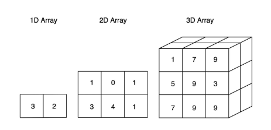

# 🔲 Matrix

## 📘 What is a Matrix?

A Matrix is a collection of elements arranged in:
- Rows
- Columns

A Matrix is also called:
- 2D Array
- Grid Structure

You can think of a matrix as:
> Multiple 1D arrays stacked together.

---

## 🧠 Why Learn Matrix?

Matrices are heavily used in:
- Board games
- Image processing
- Dynamic Programming
- Graph problems
- Backtracking
- Game development
- AI/ML
- Path finding problems

---

## 🧱 Matrix Representation

Example:

```txt
1 2 3
4 5 6
7 8 9
```

Representation:

```txt
[
 [1, 2, 3],
 [4, 5, 6],
 [7, 8, 9]
]
```

---

## 📏 Matrix Dimensions

Matrix dimensions are represented as:

```txt
Rows × Columns
```

Example:

```txt
3 × 3
```

means:
- 3 rows
- 3 columns

---

## 🔢 Matrix Indexing

Each element is identified using:

```txt
matrix[row][column]
```

Example:

```txt
matrix[1][2]
```

means:
- Row index = 1
- Column index = 2

---

## 📚 Types of Matrix

---

### ➖ Row Matrix

A matrix with:
- Only 1 row
- Multiple columns

Example:

```txt
[1 2 3 4]
```

Dimension:

```txt
1 × n
```

---

### ➖ Column Matrix

A matrix with:
- Multiple rows
- Only 1 column

Example:

```txt
[
 [1],
 [2],
 [3]
]
```

Dimension:

```txt
n × 1
```

---

### ⬛ Square Matrix

A matrix where:

```txt
rows == columns
```

Example:

```txt
[
 [1, 2],
 [3, 4]
]
```

Dimension:

```txt
2 × 2
```

---

### ▭ Rectangular Matrix

A matrix where:

```txt
rows != columns
```

Example:

```txt
[
 [1, 2, 3],
 [4, 5, 6]
]
```

Dimension:

```txt
2 × 3
```

---

## 🖼️ Visualization of Arrays

You can visualize:

- 1D Array → Line
- 2D Array → Grid
- 3D Array → Collection of grids

> Matrix Visualization:
>
> 

---

## ⌨️ Taking Matrix Input

---

### Python

```py
matrix = [
    [1, 2, 3],
    [4, 5, 6],
    [7, 8, 9]
]
```

#### Method 1
```py
# Taking input for row elements
row_input = input("Enter row elements: ") # User types: 1 2 3 4
row_elements = [int(x) for x in row_input.split()]

# Taking input for col elements
col_input = input("Enter col elements: ") # User types: 3 4 5 6
col_elements = [int(x) for x in col_input.split()]

# Combining them into a 2D matrix
matrix = [row_elements, col_elements]
```

#### Method 2
```py
matrix = [list(map(int, input("Rows: ").split())), list(map(int, input("Cols: ").split()))]
```

---

## 🚶 Matrix Traversal

Traversal means visiting every element in the matrix.

Since matrix is 2D:
- One loop handles rows
- One loop handles columns

---

### 🔄 Traversal Template

### JavaScript

```js
for(let row = 0; row < matrix.length; row++) {

    for(let col = 0; col < matrix[0].length; col++) {

        console.log(matrix[row][col]);

    }
}
```

---

### Python

```py
for row in range(len(matrix)):

    for col in range(len(matrix[0])):

        print(matrix[row][col])
```

---

## 📌 Common Matrix Traversals

---

### 🔹 Row Wise Traversal

Print all columns for each row.

Example:

```txt
1 2 3
4 5 6
7 8 9
```

Output:

```txt
1 2 3 4 5 6 7 8 9
```

---

### 🔹 Column Wise Traversal

Print all rows for each column.

Output:

```txt
1 4 7 2 5 8 3 6 9
```

---

### 🔹 Diagonal Traversal

Main diagonal elements satisfy:

```txt
row == col
```

Example:

```txt
1 2 3
4 5 6
7 8 9
```

Main diagonal:

```txt
1 5 9
```

---

### 🔹 Non-Diagonal Elements

Non-diagonal elements satisfy:

```txt
row != col
```

Example:

```txt
2 3 4 6 7 8
```

---

## ⚙️ Common Matrix Operations

---

### ➕ Matrix Addition

Two matrices can be added when:
- Number of rows are same
- Number of columns are same

---

### Pseudo Code

```txt
for each row:
    for each column:
        result[row][col] =
        matrix1[row][col] + matrix2[row][col]
```

---

### ➖ Matrix Subtraction

Subtract corresponding elements.

---

### Pseudo Code

```txt
for each row:
    for each column:
        result[row][col] =
        matrix1[row][col] - matrix2[row][col]
```

---

### ✖️ Matrix Multiplication

Condition:

```txt
Columns of matrix1 == Rows of matrix2
```

---

### Pseudo Code

```txt
for each row:
    for each column:
        multiply corresponding elements
        and store the sum
```

---

### 🔄 Matrix Transpose

Transpose means:
- Converting rows into columns
- Converting columns into rows

---

### Example

Original:

```txt
1 2 3
4 5 6
```

Transpose:

```txt
1 4
2 5
3 6
```

---

### Pseudo Code

```txt
transpose[col][row] = matrix[row][col]
```

---

### 🔁 Matrix Rotation

Matrix rotation is a very common interview problem.

---

### 🔹 90° Clockwise Rotation

### Easy Trick

#### Step 1
Transpose the matrix

#### Step 2
Reverse every row

---

### Example

Original:

```txt
1 2 3
4 5 6
7 8 9
```

After transpose:

```txt
1 4 7
2 5 8
3 6 9
```

After reversing rows:

```txt
7 4 1
8 5 2
9 6 3
```

---

### 🔹 90° Anti-Clockwise Rotation

#### Step 1
Transpose the matrix

#### Step 2
Reverse every column

---

### 📊 Diagonal Sum

Main diagonal condition:

```txt
row == col
```

---

### Pseudo Code

```txt
sum = 0

for each row:
    for each col:

        if row == col:
            sum += matrix[row][col]
```

---

### 📊 Non-Diagonal Sum

Condition:

```txt
row != col
```

---

### Pseudo Code

```txt
sum = 0

for each row:
    for each col:

        if row != col:
            sum += matrix[row][col]
```

---

## 📈 Time Complexity of Matrix Traversal

| Operation | Complexity |
|-----------|------------|
| Traversal | O(row × col) |
| Addition | O(row × col) |
| Transpose | O(row × col) |
| Rotation | O(row × col) |

---

## 🌍 Real World Use Cases of Matrix

Matrices are used in:

- Chess board representation
- Sudoku problems
- Image processing
- Graph representation
- Dynamic Programming
- Path finding algorithms
- Computer graphics
- Machine Learning

---

## 💡 Most Common Matrix Interview Questions

### Easy Level

- LeetCode 867 → Transpose Matrix
- LeetCode 1572 → Matrix Diagonal Sum
- LeetCode 566 → Reshape the Matrix
- LeetCode 54 → Spiral Matrix

---

### Medium Level

- LeetCode 48 → Rotate Image
- LeetCode 73 → Set Matrix Zeroes
- LeetCode 289 → Game of Life
- LeetCode 74 → Search a 2D Matrix

---

### Advanced Level

- LeetCode 240 → Search a 2D Matrix II
- LeetCode 85 → Maximal Rectangle
- LeetCode 221 → Maximal Square

---

## 🧠 Interview Notes

- Matrix problems are usually solved using nested loops.
- Always keep track of:
  - Rows
  - Columns
- Diagonal problems mostly use:
  - `row == col`
  - `row + col == n - 1`
- Rotation problems usually involve:
  - Transpose
  - Reverse

---

## ⚠️ Common Beginner Mistakes

- Confusing rows and columns
- Incorrect loop boundaries
- Accessing invalid indexes
- Forgetting matrix dimensions
- Wrong diagonal conditions
- Using square matrix logic for rectangular matrices

---

## 🚀 Quick Revision Tips

| Concept | Key Idea |
|---------|----------|
| Traversal | Nested loops |
| Main Diagonal | row == col |
| Secondary Diagonal | row + col == n - 1 |
| Transpose | Swap rows & columns |
| Rotation | Transpose + Reverse |

---

## 📌 Summary

In this section, we covered:

- Matrix Basics
- Matrix Dimensions
- Matrix Types
- Matrix Traversal
- Row Wise Traversal
- Column Wise Traversal
- Diagonal Traversal
- Matrix Addition
- Matrix Multiplication
- Matrix Transpose
- Matrix Rotation
- Diagonal Sum
- Non-Diagonal Sum
- Common Interview Questions

Matrices are one of the most important DSA topics and are heavily used in:
- Graphs
- Dynamic Programming
- Backtracking
- Game Development
- Grid-based Problems