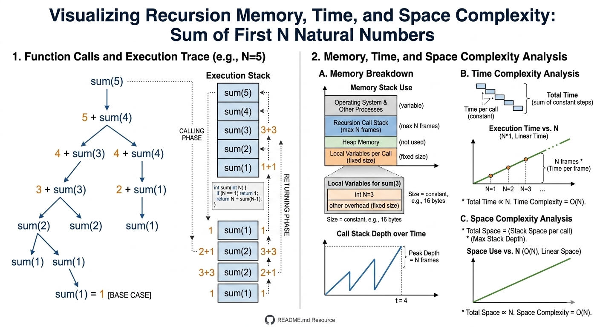
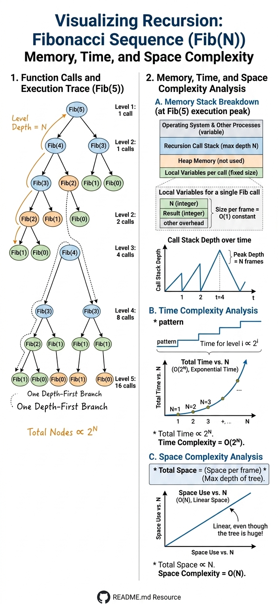

# 🔁 Recursion

## 📘 What is Recursion?

Recursion is a programming technique where:
> A function calls itself to solve smaller instances of the same problem.

Instead of solving the complete problem at once, recursion:
- Breaks the problem into smaller sub-problems
- Solves them repeatedly
- Combines the results

---

## 🧠 Simple Idea Behind Recursion

Think like this:

```txt
Big Problem
   ↓
Smaller Problem
   ↓
Even Smaller Problem
   ↓
Base Condition
```

Once the base condition is reached, the function starts returning back.

---

## 🌍 Real World Examples

### 🎬 Counting Rows in a Movie Theater

```txt
Row 10
asks Row 9
asks Row 8
asks Row 7
...
```

---

### 📖 Searching a Word in Dictionary

You repeatedly:
- Divide pages
- Narrow search space
- Continue until word is found

This resembles recursive thinking.

---

## ❓ Why Learn Recursion?

Recursion is important because:

✅ Recursive solutions are often:
- Cleaner
- Shorter
- Easier to understand

---

✅ Useful for:
- Trees
- Graphs
- Linked Lists
- Backtracking
- Divide and Conquer

---

✅ Helps develop:
- Problem-solving skills
- Recursive thinking
- Top-down approach

---

## 📌 When Should We Use Recursion?

Use recursion when:

✅ A problem can be divided into:
- Smaller repetitive subproblems

---

✅ The problem has:
- Multiple branches
- Repeated structure

---

### Common Examples

- Fibonacci
- Tree Traversal
- Factorial
- Backtracking
- DFS
- Dynamic Programming

---

## 🔄 Recursion vs Iteration

Many recursive problems can also be solved iteratively.

---

### ⚔️ Recursion vs Iteration

| Feature | Recursion | Iteration |
|---------|------------|-----------|
| Approach | Top-Down | Bottom-Up |
| Uses | Function Calls | Loops |
| Memory Usage | More | Less |
| Speed | Usually slower | Usually faster |
| Readability | Cleaner | Sometimes lengthy |
| Stack Memory | Required | Not required |

---

## 🧠 Is Recursion Better Than Iteration?

### ✅ Recursion is Better When:

- Problem is naturally recursive
- Multiple nested loops are needed
- Tree/graph traversal is involved
- Code readability matters

---

### ✅ Iteration is Better When:

- Memory optimization is important
- Recursion depth becomes huge
- Simpler loops can solve the problem

---

## ⚠️ Why Does Recursion Use More Space?

Every recursive call is stored inside:
- Call Stack
- Stack Memory

Each function call waits until:
- Smaller recursive calls complete

---

## 🧱 Key Aspects of Recursion

---

### 1️⃣ Base Condition

The stopping condition.

Without it:
❌ Infinite recursion happens.

---

#### Example

```txt
if(n <= 1)
```

---

### 2️⃣ Recursive Condition

The function calling itself with a smaller input.

---

#### Example

```txt
return n + sum(n - 1)
```

---

### 3️⃣ Function Signature

Includes:
- Return type
- Parameters

---

## 🔄 General Recursive Template

### JavaScript

```js
function recurse(input) {

    // Base condition
    if(condition) {
        return;
    }

    // Recursive call
    recurse(smallerInput);

}
```

---

### Python

```py
def recurse(input):

    # Base condition
    if condition:
        return

    # Recursive call
    recurse(smaller_input)
```

---

## 📊 Understanding Call Stack

Every recursive call gets added to the stack.

Example:

```txt
sum(3)
 ↓
sum(2)
 ↓
sum(1)
 ↓
return
```

Then functions return back in reverse order.

---

## 🧠 Call Stack Visualization

### Example

```txt
sum(3)
= 3 + sum(2)

sum(2)
= 2 + sum(1)

sum(1)
= 1
```

Stack:

```txt
sum(3)
sum(2)
sum(1)
```

Returning:

```txt
1
2 + 1 = 3
3 + 3 = 6
```

---

### 🔢 Example 1: Sum of N Natural Numbers

---

### JavaScript

```js
function naturalSum(n) {

    if(n <= 1) {
        return 1;
    }

    return n + naturalSum(n - 1);
}
```

---

### Python

```py
def natural_sum(n):

    if n <= 1:
        return 1

    return n + natural_sum(n - 1)
```

---

### 📈 Time Complexity

```txt
O(n)
```

---

### 📦 Space Complexity

```txt
O(n)
```

Why?

Because:
- Recursive calls are stored in stack memory.

---

### 🧠 Recursive Recurrence

```txt
f(n)   = n + f(n-1)
f(n-1) = n-1 + f(n-2)
f(n-2) = n-2 + f(n-3)
...
```

This breakdown is why recursion is called:
> Top-Down Approach

---



---

### 🔢 Example 2: Fibonacci Series

---

### 📘 Fibonacci Formula

```txt
F(n) = F(n-1) + F(n-2)
```

Base cases:

```txt
F(0) = 0
F(1) = 1
```

Series:

```txt
0 1 1 2 3 5 8 13 21 ...
```

---

### JavaScript

```js
function fibonacci(n) {

    if(n <= 1) {
        return n;
    }

    return fibonacci(n - 1) + fibonacci(n - 2);
}
```

---

### Python

```py
def fibonacci(n):

    if n <= 1:
        return n

    return fibonacci(n - 1) + fibonacci(n - 2)
```

---

### 📈 Time Complexity

```txt
O(2^n)
```

---

### 📦 Space Complexity

```txt
O(n)
```

---

### 🌳 Recursive Tree Visualization

Example:

```txt
fibonacci(4)

             4
          /     \
         3       2
       /   \    / \
      2     1  1   0
     / \
    1   0
```

---



---

## 🧠 How to Analyze Recursive Complexity?

### Time Complexity

Observe:
> Horizontal Width of Recursive Tree

---

### Space Complexity

Observe:
> Vertical Height of Recursive Tree

---

## 🔄 Example to Understand Recursion Better

### JavaScript

```js
function printN(N) {

    if(N <= 0) {
        return;
    }

    printN(N - 1);

    console.log(N);

    printN(N - 1);
}
```

---

### Python

```py
def print_n(N):

    if N <= 0:
        return

    print_n(N - 1)

    print(N)

    print_n(N - 1)
```

---

## 🛠️ Steps to Write a Recursive Function

### Step 1

Define Base Condition

---

### Step 2

Write Recursive Recurrence

---

### Step 3

Decide Return Type

---

## 🌍 Common Use Cases of Recursion

Recursion is heavily used in:

- Tree Traversal
- Graph Traversal
- Backtracking
- Divide and Conquer
- Dynamic Programming
- DFS
- Maze Problems
- File Systems
- Binary Search

---

## 💡 Most Common Recursion Interview Questions

### Beginner Level

- LeetCode 509 → Fibonacci Number
- LeetCode 70 → Climbing Stairs
- LeetCode 344 → Reverse String
- LeetCode 231 → Power of Two

---

### Medium Level

- LeetCode 46 → Permutations
- LeetCode 78 → Subsets
- LeetCode 22 → Generate Parentheses
- LeetCode 39 → Combination Sum

---

### Advanced Level

- LeetCode 51 → N-Queens
- LeetCode 37 → Sudoku Solver
- LeetCode 124 → Binary Tree Maximum Path Sum
- LeetCode 52 → N-Queens II

---

## ⚠️ Common Beginner Mistakes

- Forgetting base condition
- Infinite recursion
- Wrong recursive call
- Stack overflow
- Incorrect return statements
- Not reducing problem size

---

## 🧠 Interview Notes

- Recursion is a very important DSA concept.
- Most tree and graph problems use recursion.
- Always think:
  
```txt
"What is the smaller subproblem?"
```

- Recursive thinking improves problem-solving ability.
- Dry run recursive calls manually to understand flow.

---

## 🚀 Quick Revision Tips

| Concept | Key Idea |
|---------|----------|
| Base Condition | Stops recursion |
| Recursive Call | Function calls itself |
| Stack Memory | Stores recursive calls |
| Top-Down | Recursive approach |
| Bottom-Up | Iterative approach |

---

## 📌 Summary

In this section, we covered:

- What is Recursion
- Why use Recursion
- Recursion vs Iteration
- Base Condition
- Recursive Condition
- Call Stack
- Stack Memory
- Fibonacci Series
- Recursive Tree
- Recursive Complexity
- Recursive Templates
- Interview Problems

Recursion is one of the most important foundations for advanced DSA topics like:
- Trees
- Graphs
- Dynamic Programming
- Backtracking
- Divide and Conquer
```